<div align="center">
<p align="center">
  <picture>
    <source media="(prefers-color-scheme: dark)" srcset="./resource/logo-blanco.png">
    <source media="(prefers-color-scheme: light)" srcset="./resource/logo-negro.png">
    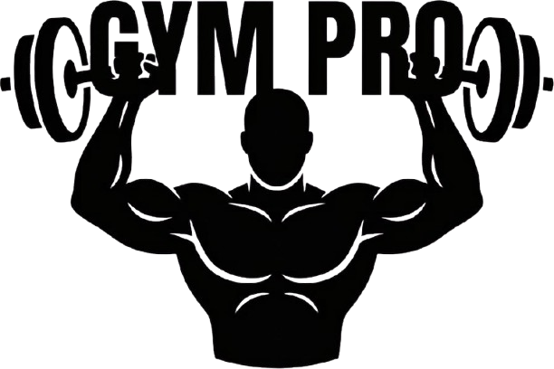
  </picture>
</p>
  
### Sistema Web de Gestión de Rutinas y Entrenamiento Guiado

[](https://nodejs.org/)
[](https://expressjs.com/)
[](https://www.sqlite.org/)
[](https://ai.google.dev/)
[](https://developer.mozilla.org/es/docs/Web/JavaScript)
[](LICENSE)

**Para la asignación de rutinas de gimnasio de Entrenador a Cliente, llevar seguimiento de entrenamiento progresivo físico como plataforma para tres roles diferenciados (Administardor, Entrenador y Alumno) y asistente de IA contextualizado.**

[Descripción](#-descripción) •
[Características](#-características) •
[Demo](https://gympro-24ly.onrender.com/) •
[Stack Tecnológico](#%EF%B8%8F-stack-tecnológico) •
[Instalación](#-instalación)

</div>

## 📌 Descripción

**GymPro** es una aplicación web que centraliza la gestión de rutinas
de entrenamiento, el seguimiento del progreso físico y la interacción entre
instructores y alumnos de un gimnasio.

Busca ser una nueva alternativa a aplicaciones conocidas como Gym WP, Ejercicios en Casa: Sin equipo y Hevy, la cual permita el registro de usuarios con **tres roles diferenciados** y un
**asistente de IA contextualizado** que conoce la rutina, el progreso y la
fecha actual del usuario cliente/alumno.

### 📂 Estructura de carpetas

Así está organizado el proyecto por dentro. Cada carpeta tiene una responsabilidad clara:

```
gympro/
├── 📁 db/                          # Todo lo relacionado con la base de datos
│   ├── database.js                 # Abre la conexión con la BD y crea los usuarios/ejercicios iniciales
│   └── schema.sql                  # Define las tablas donde se guarda la información
│
├── 📁 middlewares/                 # Revisa cada acción del usuario y deja un registro para auditoría.
│   └── auditMiddleware.js          # Anota en un archivo .log TODO lo que hacen los usuarios
│
├── 📁 routes/                      # Acciones que el frontend puede pedirle al servidor
│   ├── auth.js                     # Entrar, registrarse y salir de la app
│   ├── users.js                    # Crear, ver, editar y borrar usuarios
│   ├── exercises.js                # Administrar el catálogo de ejercicios disponibles
│   ├── routines.js                 # Crear rutinas y asignarlas a los alumnos
│   ├── sessions.js                 # Guardar y consultar el historial de entrenamientos
│   └── ai.js                       # Hablar con el asistente de Inteligencia Artificial
│
├── 📁 services/                    # Lógica del sistema
│   ├── aiService.js                # Se comunica con Google Gemini (la IA)
│   ├── contextBuilder.js           # Le da datos reales al chat (tu rutina, tu progreso) para que la IA responda bien
│   ├── prompts.js                  # Define la personalidad y reglas de cada asistente IA
│   └── logger.js                   # Escribe el archivo de auditoría (activity.log)
│
├── 📁 public/                      # Todo lo que ve el usuario en el navegador
│   ├── index.html                  # La página principal (login, dashboards, modales, chat)
│   ├── 📁 css/
│   │   └── styles.css              # Los colores, tamaños y diseño de la app
│   └── 📁 js/                      # Toda la interactividad del navegador
│       ├── api.js                  # Habla con el servidor (pide y envía datos)
│       ├── storage.js              # Guarda temporalmente los datos en el navegador
│       ├── aiChat.js               # La ventana flotante del chat con IA
│       ├── app.js                  # Controla el login y la navegación principal
│       ├── admin.js                # Panel del administrador
│       ├── coach.js                # Panel del entrenador
│       ├── appClient.js            # Panel del alumno
│       ├── workoutPlayer.js        # El reproductor de entrenamiento con cronómetros
│       └── 📁 models/              # Representación orientada a objetos del gimnasio (Usuario, Rutina, Ejercicio...)
│
├── 📁 docs/                        # Documentación y material de apoyo
│   ├── diagramas/                   # Dibujos técnicos del sistema (UML, base de datos)
│   └── screenshots/                # Capturas de pantalla de la app
│
├── .env.example                    # Configuración de variables del sistema (aquí se coloca la API key)
├── package.json                    # Lista de dependencias y comandos del proyecto
├── server.js                       # Arranca el servidor
└── README.md                       # Archivo Readme.md
```

### 🗺️ Descripción de carpetas principales

| Carpeta | Propósito | Archivos clave |
|---------|-----------|----------------|
| `db/` | Persistencia en SQLite | `schema.sql`, `database.js` |
| `middlewares/` | Interceptores de Express | `auditMiddleware.js` |
| `routes/` | Endpoints REST agrupados por dominio | `auth.js`, `routines.js`, `ai.js` |
| `services/` | Lógica de negocio y utilidades | `aiService.js`, `logger.js` |
| `public/` | Frontend (HTML + CSS + JS vanilla) | `index.html`, `styles.css` |
| `public/js/` | Lógica cliente modular por rol | `admin.js`, `coach.js`, `appClient.js` |
| `public/js/models/` | Clases del dominio (POO) | `Usuario.js`, `Rutina.js` |
| `docs/` | Documentación técnica del proyecto | Diagramas UML, capturas |

### 🎯 Problemática que resuelve

| Problema | Solución GymPro |
|----------|-----------------|
| Aplicaciones como: Gym WP, Ejercicios en Casa: Sin equipo y Hevy no están diseñadas para el manejo de usuarios por roles | Plataforma diseñada en el que cada usuario se registrará según su rol que cumpla en la aplicación, el cual entrenador pueda asignar rutina a cliente |
| Alumnos no saben qué hacer, cuánto descansar o con qué peso | Reproductor guiado en tiempo real con cronómetros y registro automático del progreso |
| Los alumnos no llevan un control de su progreso | Historial automático con pesos máximos por ejercicio |
| Se desconoce si el alumno entrena los días que le tocan | Validación por días + bloqueo automático |
| Suscripciones o pagos a planes por mensualidades por uso de IA | Gratuita, los alumnos de un entrenador pueden interactuar con un asistente de IA para que le devuelva recomendaciones y evolución de su progreso. |

## ✨ Características

### 🔐 Autenticación y Seguridad

- Registro e inicio de sesión con **email + contraseña**
- Contraseñas cifradas con **bcrypt** (10 rondas de hashing)
- Manejo de **3 roles**: `Administrador`, `Entrenador`, `Cliente`
- Foto de perfil personalizable con **redimensionado automático** en el navegador
- Sesión activa persistente para reanudar entrenamientos tras recargar

### 👑 Panel de Administrador

- **CRUD completo de usuarios** con tabla interactiva
- Gestión del **catálogo global de ejercicios**
- Supervisión de **todas las rutinas** y sus asignaciones
- **Métricas globales**: clientes, entrenadores, rutinas, sesiones

### 💪 Panel de Instructor / Coach

- **Constructor visual de rutinas** con:
  - Selector múltiple de días de la semana (chips)
  - Series, reps/tiempo, descanso y peso sugerido por ejercicio
  - Reordenamiento según como se hayan añadido los ejercicios en la creación de rutinas.
  - Asignación directa a un alumno o guardado como plantilla
- **Gestión de alumnos** con vista de rutina actual y progreso
- **Modal de progreso** con historial detallado y **resumen semanal** con tendencias (↑ ↓ =)

### 🏃 Panel de Cliente / Alumno

- **Vista de rutina asignada** con badge "🔥 Hoy toca" según día actual
- **Validación de días**: si hoy no toca, el botón se bloquea con aviso
- **Reproductor de entrenamiento guiado** con:
  - Cronómetro general de sesión
  - Cronómetro por ejercicio (ascendente o descendente)
  - Cronómetro de descanso con ajuste ±15s
  - Registro de peso real usado por serie
  - Botones de pausa, saltar ejercicio, agregar serie extra
- **Resumen final** con duración total vs efectiva y desglose por ejercicio
- **Historial de sesiones** con chips de duración y pesos máximos
- **Chat con IA** (GymBot) consciente de la fecha, rutina y progreso

### 🤖 Asistente de IA

- **GymBot**: explicaciones de técnica, motivación, análisis de progreso para clientes.
- **Contexto dinámico**: el backend inyecta datos reales de la BD en cada consulta
- **Consciencia temporal**: sabe qué día es hoy y si toca entrenar
- **Historial de persistencia**: conversaciones guardadas como una sesión de chat.
- **Reglas estrictas**: no inventa datos, no da consejos médicos

## 🛠️ Stack Tecnológico

### Backend

| Tecnología | Versión | Rol |
|-----------|---------|-----|
| **Node.js** | 20+ | Entorno de ejecución |
| **Express.js** | 4.x | Framework HTTP y enrutamiento REST |
| **SQLite3** | 5.x | Motor de base de datos embebido |
| **bcryptjs** | 2.4 | Hash de contraseñas |
| **cors** | 2.8 | Habilitar peticiones cross-origin |
| **dotenv** | 16.x | Gestión de variables de entorno |
| **@google/genai** | 2.5 | SDK oficial del cliente Gemini |


### Frontend

| Tecnología | Rol |
|-----------|-----|
| **HTML5** | Estructura semántica |
| **CSS3** | Variables CSS, Flexbox, Grid, animaciones |
| **JavaScript ES6+** | Lógica cliente, fetch API, FileReader, Canvas |

### Integraciones

| Servicio | Rol |
|----------|-----|
| **Google Gemini 2.5 Flash** | Modelo de IA para el chat contextualizado |

### Herramientas de desarrollo

| Herramienta | Uso |
|-------------|-----|
| **Sublime Text** | Editor principal |
| **Git + GitHub** | Control de versiones |
| **Google AI Studio** | Generación de API key de Gemini |


## 🚀 Instalación

### Requisitos previos

- **Node.js** v20 o superior ([descargar](https://nodejs.org/))
- **npm** v9 o superior (viene con Node.js)
- **API Key de Google Gemini** ([obtener gratis](https://aistudio.google.com/app/apikey))

### 🔐 Preparación de la API de GEMINI IA en variables de entorno (`.env`)

Luego abre el archivo `.env.example` con tu editor y rellena los campos, puedes cambiar los valores que trae por defecto y configurarlos a su manera:

```bash
# API Key de Google Gemini (Google AI STUDIO)
GEMINI_API_KEY=tu_api_key_real

# Modelo a usar
# Opciones comunes: gemini-2.5-flash, gemini-2.5-pro, gemini-1.5-flash
# - flash: más rápido y económico (recomendado)
# - pro:   más potente pero más caro
AI_MODEL=gemini-2.5-flash

# Valores típicos: 500 (respuestas cortas), 800 (equilibrado), 1500 (detalladas)
AI_MAX_TOKENS=800

# Creatividad del modelo (0.0 = determinista, 1.0 = muy creativo)
# - 0.2  respuestas técnicas y precisas
# - 0.7  balance entre precisión y naturalidad
# - 1.0  muy creativo (puede divagar)
AI_TEMPERATURE=0.7

# Puerto del servidor (opcional, por defecto 3000 y configurable)
PORT=5000

# Para firmar los JWT, solo escribe una
JWT_SECRET=cambia_esto_por_un_secreto_largo_y_aleatorio_de_32_o_mas_caracteres

# Tiempo de expiración del token
# Acepta formato: s (segundos), m (minutos), h (horas), d (días)
#
#  Valores típicos:
#   15s   solo para pruebas de expiración
#   1h    sesiones cortas (más seguro)
#   4h    sesión media jornada
#   8h    jornada laboral completa (recomendable)
#   24h   sesión extendida
#   7d    "recordarme" en móvil
JWT_EXPIRES_IN=15s
```

### Clonar y ejecutar proyecto

```bash
# 1. Clonar el repositorio
git clone https://github.com/tu-usuario/gympro.git
cd gympro

# 2. Instalar dependencias
npm install

# 3. Configurar variables de entorno: editar .env.example

# 4. Iniciar el servidor
npm start

# 5. Abrir en el navegador
# http://localhost:5000
```
## Integrantes del Equipo de Desarrollo
- Audio Silva
- Santiago Verges
- Angel Trejo

## 📸 Evidencias y Capturas del Sistema

Galería completa de la aplicación en funcionamiento, organizada por flujo de uso.

---

### 🔐 1. Autenticación — Pantalla de Inicio de Sesión

Interfaz principal de acceso con validación de credenciales, selector de rol implícito y opción de registro para nuevos usuarios.

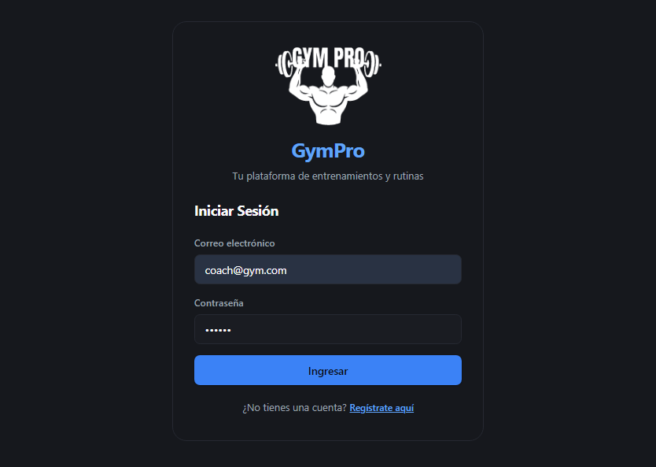

---

### 👑 2. Panel del Administrador

#### 2.1 Métricas Globales y Gestión de Usuarios

Vista principal del administrador con:
- **4 métricas globales**: clientes, instructores, rutinas creadas y sesiones realizadas
- **Tabla CRUD de usuarios** con avatar, email, rol y acciones (editar/eliminar)
- **Diferenciación de roles** con badges de colores (Administrador, Instructor, Cliente)

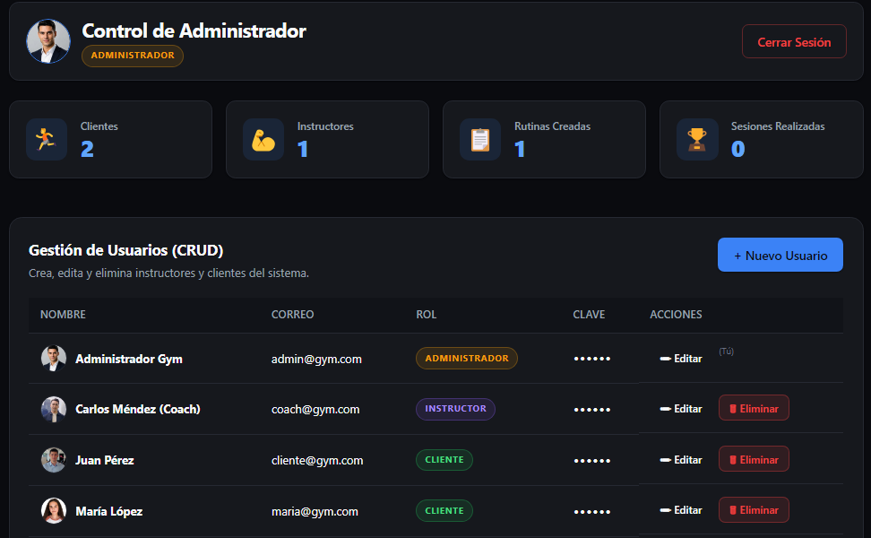

#### 2.2 Catálogo Oficial de Ejercicios

Banco global de ejercicios disponibles para que los instructores armen sus rutinas:
- Cada ejercicio muestra **imagen/thumbnail**, **nombre**, **grupo muscular** y **tipo** (Por Tiempo / Por Repeticiones)
- **Descripción técnica** de cada ejercicio
- Botón para agregar nuevos ejercicios al catálogo

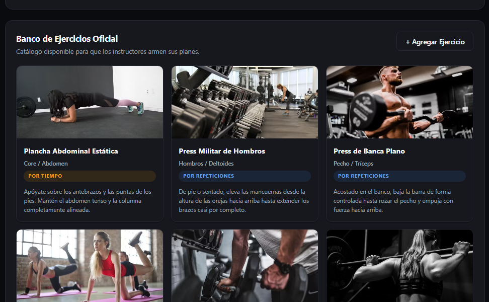

---

### 💪 3. Panel del Instructor / Coach

#### 3.1 Gestor de Rutinas

Vista principal del coach con todas las rutinas creadas:
- **Nombre y días programados** de cada rutina
- **Cantidad de ejercicios** con badge informativo
- **Cliente asignado** (o plantilla sin asignar)
- Botones de **Editar** y **Eliminar**
- Botón para **crear nueva rutina**

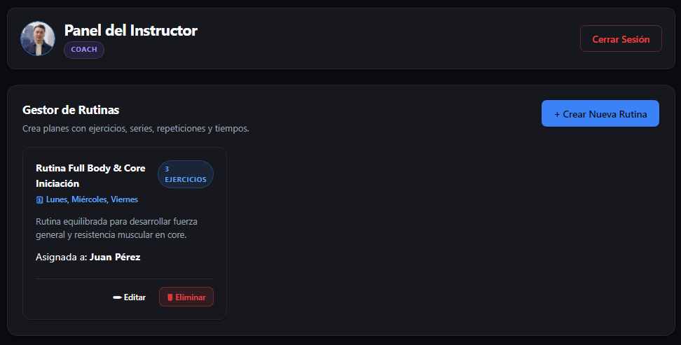

#### 3.2 Lista de Alumnos

Panel de gestión de alumnos con:
- **Avatar y datos de cada cliente** (nombre, email)
- **Rutina asignada actualmente** (o "Sin rutina asignada")
- **Contador de entrenamientos completados**
- Acciones rápidas: **Asignar Rutina** y **Ver Progreso**

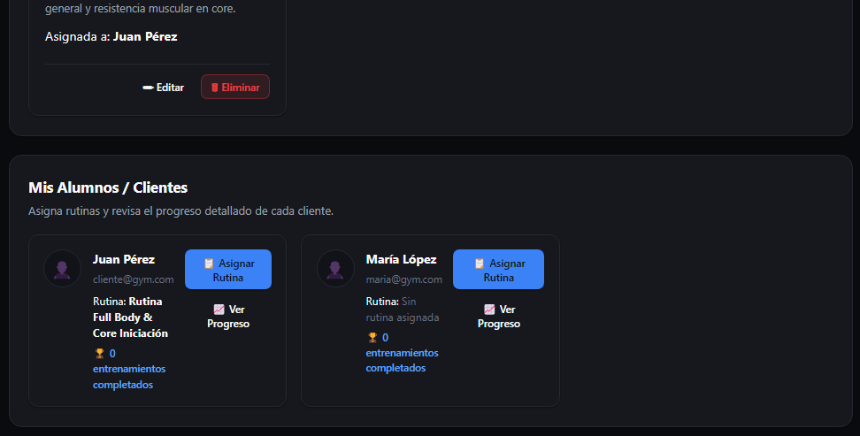

#### 3.3 Modal de Creación de Rutina (Parte 1)

Formulario del constructor de rutinas con:
- **Nombre de la rutina** y **descripción/objetivo**
- **Selector múltiple de días** con chips interactivos (Lun, Mar, Mié, Jue, Vie, Sáb, Dom)
- **Asignación directa a un alumno** desde un dropdown
- **Sección para agregar ejercicios** con series, reps, peso y descanso

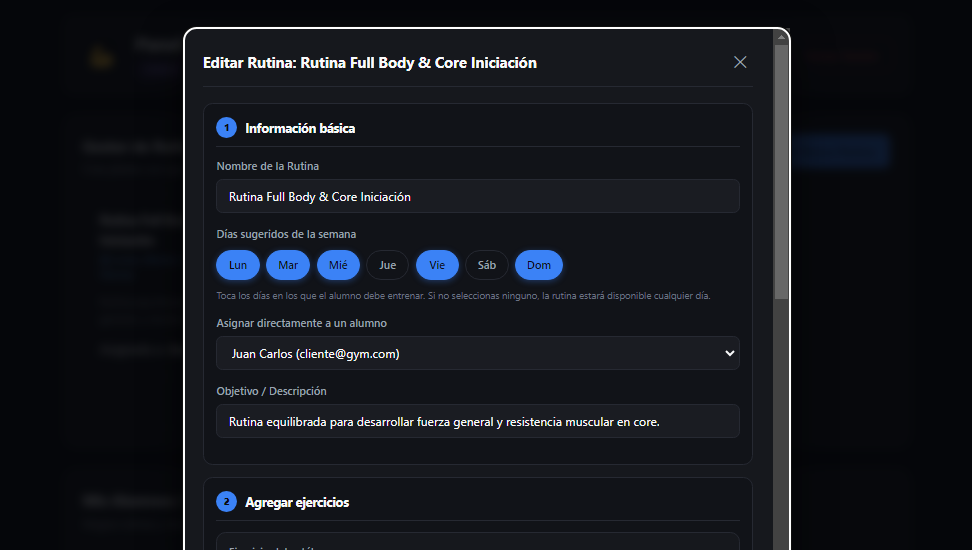

#### 3.4 Modal de Creación de Rutina (Parte 2)

Sección inferior del constructor con:
- **Formulario de agregar ejercicio**: selector del catálogo + series, reps, peso y descanso
- **Tabla de ejercicios añadidos** con orden, series, objetivo, descanso y botón de eliminar
- Validación visual del orden de los ejercicios

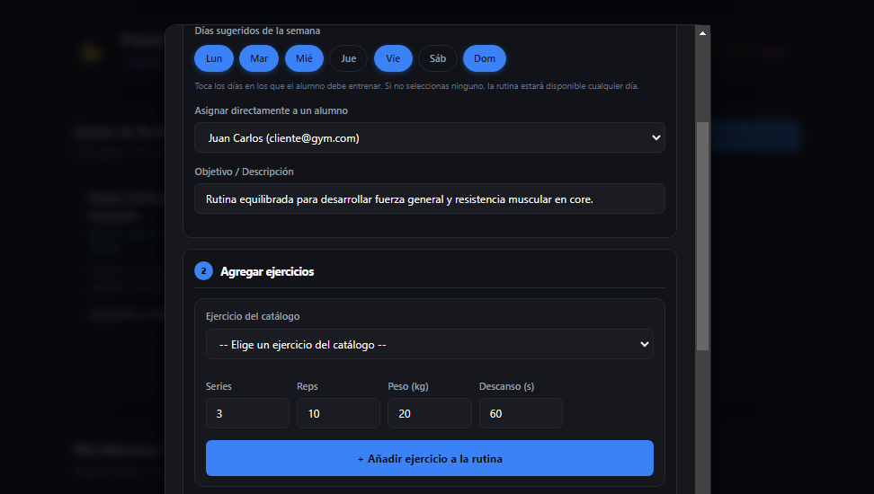

#### 3.5 Modal de Edición de Rutina

Vista del mismo constructor al **editar una rutina existente**:
- Todos los campos **precargados** con los datos actuales
- **Días ya seleccionados** con chips en estado activo
- Ejercicios listados con sus configuraciones actuales

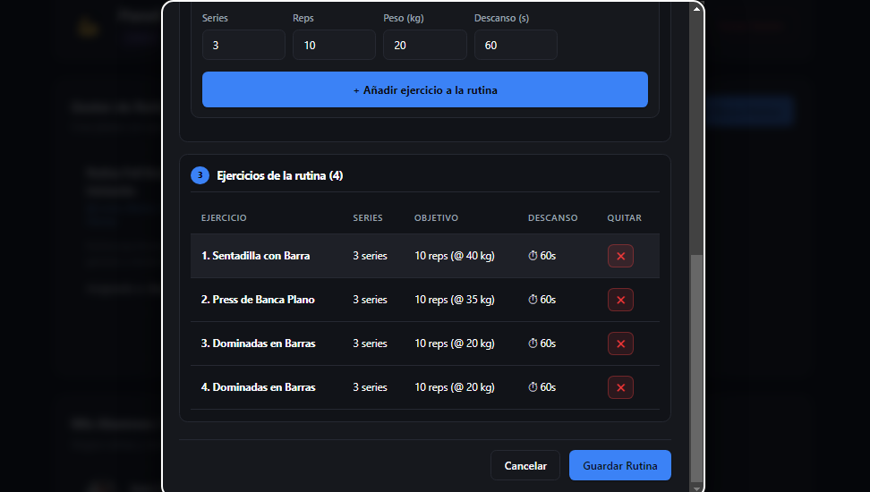

---

### 🏃 4. Panel del Cliente / Alumno

#### 4.1 Dashboard Principal y Chat con IA

Vista principal del cliente con:
- **Saludo personalizado** con nombre y rol
- **Chat flotante con GymBot** abierto, respondiendo de forma contextualizada (sabe qué día es y si toca entrenar)
- **Rutina asignada** con días programados
- **Aviso de día incorrecto**: *"Hoy no toca entrenar esta rutina"* con botón bloqueado

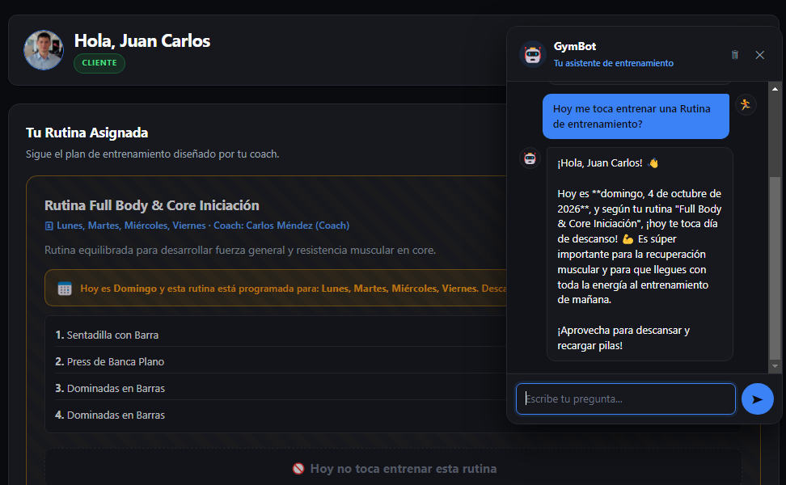

#### 4.2 Reproductor de Entrenamiento Activo

Modo entrenamiento guiado con:
- **Barra superior** con nombre de rutina y cronómetro general
- **Badge de grupo muscular** y tipo de ejercicio
- **Contador de series** (Serie 1 de 3)
- **Imagen demostrativa** del ejercicio
- **Cronómetro gigante** con tiempo del ejercicio (azul cian)
- **Tarjeta de objetivos**: reps objetivo, peso sugerido y campo editable de peso real
- **Controles secundarios**: agregar serie extra y saltar ejercicio
- **Botón gigante "Completar Serie"** con gradiente verde

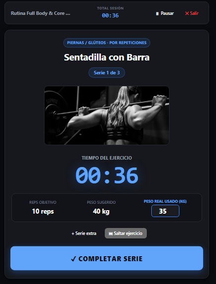

#### 4.3 Historial y Progreso del Cliente

Sección "Mi Historial y Progreso" con:
- **Contadores acumulados**: sesiones completadas y tiempo total entrenado
- **Tarjeta de sesión** con fecha, series hechas y chips de:
  - 🕐 **Duración total** (cian)
  - 💪 **Tiempo efectivo** (verde)
  - 💤 **Descanso** (naranja)
- **Desglose por ejercicio** con series hechas y peso máximo

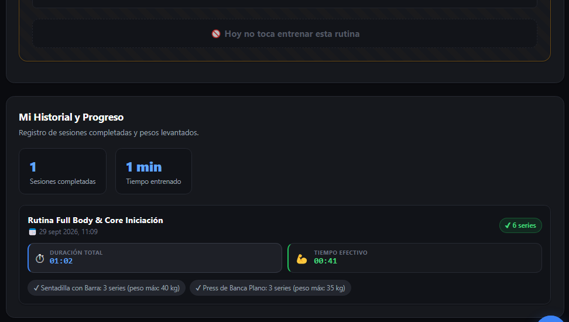

---

### 📊 6. Modal de Progreso Detallado (Vista del Coach)

#### 6.1 Detalle Completo de una Sesión

Modal del coach mostrando el progreso detallado del alumno:
- **Totales acumulados**: duración total, tiempo efectivo y descanso
- **Tabla detallada** con:
  - Ejercicio
  - Número de serie
  - Peso real usado
  - Tiempo por serie
  - Estado (Completada / Saltada)

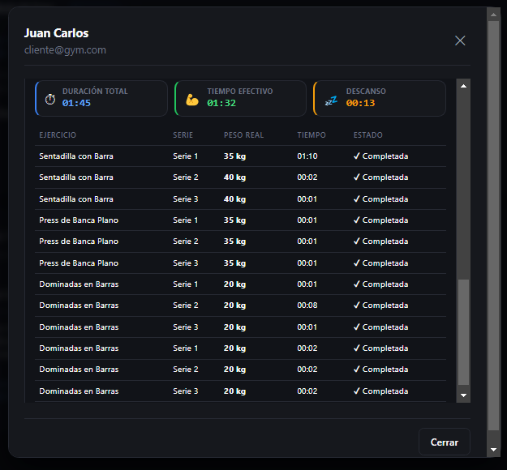

## 📊 Estado del proyecto

| Módulo | Estado |
|---|---|
| Autenticación con roles | ✅ Completado |
| CRUD usuarios / ejercicios / rutinas | ✅ Completado |
| Modo entrenamiento guiado | ✅ Completado |
| Progreso y estadísticas | ✅ Completado |
| Chat con IA contextual | ✅ Completado |
| Log de actividades | ✅ Completado |
| Resumen semanal coach | ✅ Completado |
| Responsive móvil | ✅ Completado |
| Despliegue | ✅ Através de Render |

**Versión actual:** `v1.0.0` — La cual representa la entrega final.

## 📚 Documentación adicional

- [Requisitos](./docs/requisitos.md)
- [Planificación y Gantt](./docs/planificacion.md)
- [Diagramas UML](./docs/diagramas.md)
- [Arquitectura detallada](./docs/arquitectura.md)
- [Pruebas y calidad](./docs/pruebas-calidad.md)
- [Cierre del proyecto](./docs/cierre-proyecto.md)
