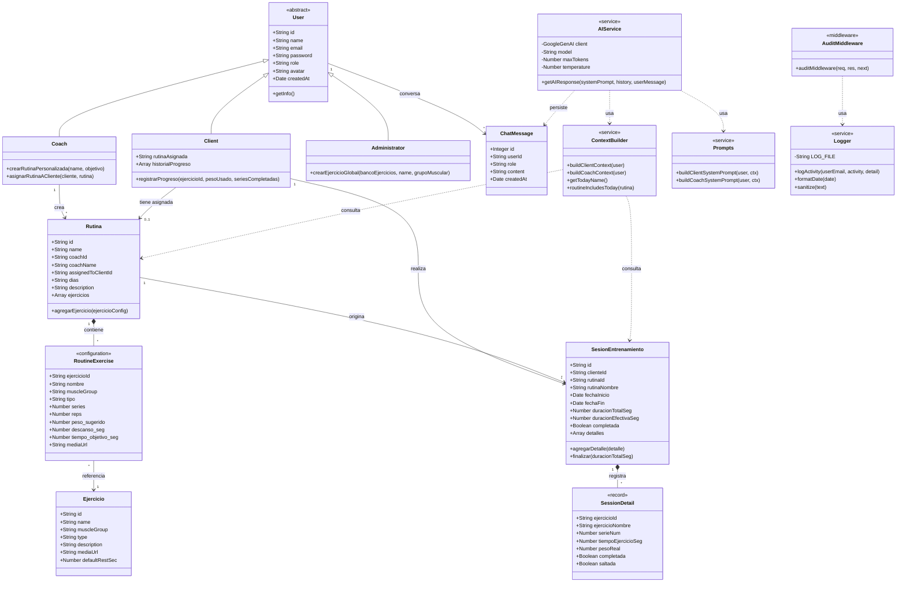
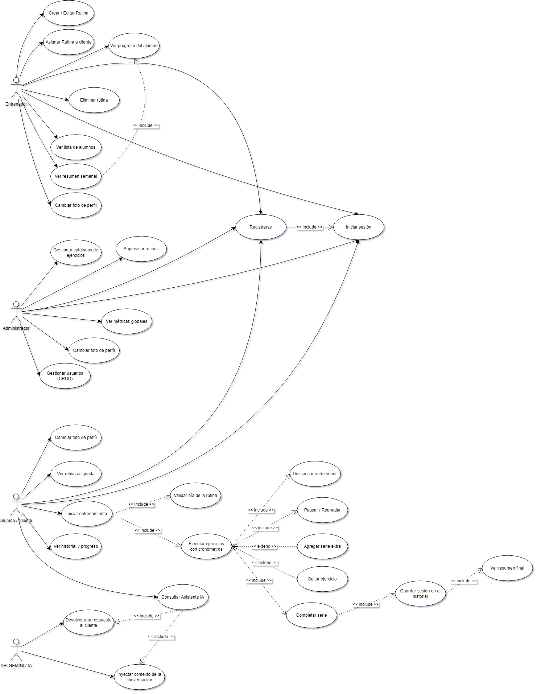
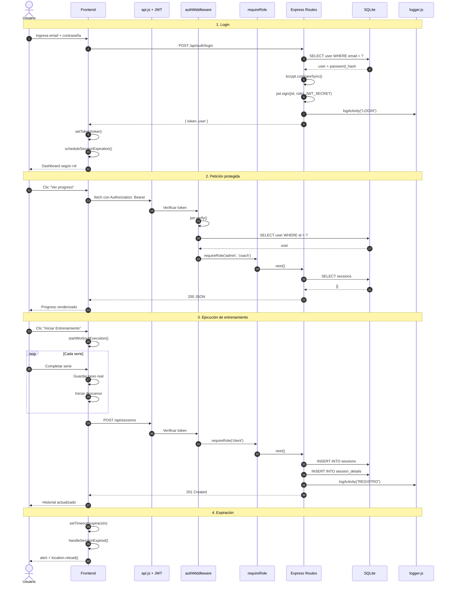

# Diagramas UML
## Diagrama de clases

```mermaid
classDiagram
    direction TB

    %% ============================================
    %% JERARQUÍA DE USUARIOS
    %% ============================================
    class User {
        <<abstract>>
        +String id
        +String name
        +String email
        +String password
        +String role
        +String avatar
        +Date createdAt
        +getInfo()
    }

    class Client {
        +String rutinaAsignada
        +Array historialProgreso
        +registrarProgreso(ejercicioId, pesoUsado, seriesCompletadas)
    }

    class Coach {
        +crearRutinaPersonalizada(name, objetivo)
        +asignarRutinaACliente(cliente, rutina)
    }

    class Administrator {
        +crearEjercicioGlobal(bancoEjercicios, name, grupoMuscular)
    }

    User <|-- Client
    User <|-- Coach
    User <|-- Administrator

    %% ============================================
    %% CATÁLOGO
    %% ============================================
    class Ejercicio {
        +String id
        +String name
        +String muscleGroup
        +String type
        +String description
        +String mediaUrl
        +Number defaultRestSec
    }

    %% ============================================
    %% RUTINAS
    %% ============================================
    class Rutina {
        +String id
        +String name
        +String coachId
        +String coachName
        +String assignedToClientId
        +String dias
        +String description
        +Array ejercicios
        +agregarEjercicio(ejercicioConfig)
    }

    class RoutineExercise {
        <<configuration>>
        +String ejercicioId
        +String nombre
        +String muscleGroup
        +String tipo
        +Number series
        +Number reps
        +Number peso_sugerido
        +Number descanso_seg
        +Number tiempo_objetivo_seg
        +String mediaUrl
    }

    Rutina "1" *-- "*" RoutineExercise : contiene
    RoutineExercise "*" --> "1" Ejercicio : referencia

    %% ============================================
    %% SESIONES DE ENTRENAMIENTO
    %% ============================================
    class SesionEntrenamiento {
        +String id
        +String clienteId
        +String rutinaId
        +String rutinaNombre
        +Date fechaInicio
        +Date fechaFin
        +Number duracionTotalSeg
        +Number duracionEfectivaSeg
        +Boolean completada
        +Array detalles
        +agregarDetalle(detalle)
        +finalizar(duracionTotalSeg)
    }

    class SessionDetail {
        <<record>>
        +String ejercicioId
        +String ejercicioNombre
        +Number serieNum
        +Number tiempoEjercicioSeg
        +Number pesoReal
        +Boolean completada
        +Boolean saltada
    }

    SesionEntrenamiento "1" *-- "*" SessionDetail : registra

    %% ============================================
    %% CHAT CON IA
    %% ============================================
    class ChatMessage {
        +Integer id
        +String userId
        +String role
        +String content
        +Date createdAt
    }

    %% ============================================
    %% SERVICIOS DEL BACKEND (no son clases JS puras, pero son componentes lógicos)
    %% ============================================
    class AIService {
        <<service>>
        -GoogleGenAI client
        -String model
        -Number maxTokens
        -Number temperature
        +getAIResponse(systemPrompt, history, userMessage)
    }

    class ContextBuilder {
        <<service>>
        +buildClientContext(user)
        +buildCoachContext(user)
        +getTodayName()
        +routineIncludesToday(rutina)
    }

    class Prompts {
        <<service>>
        +buildClientSystemPrompt(user, ctx)
        +buildCoachSystemPrompt(user, ctx)
    }

    class Logger {
        <<service>>
        -String LOG_FILE
        +logActivity(userEmail, activity, detail)
        +formatDate(date)
        +sanitize(text)
    }

    class AuditMiddleware {
        <<middleware>>
        +auditMiddleware(req, res, next)
    }

    %% ============================================
    %% RELACIONES ENTRE CLASES DEL DOMINIO
    %% ============================================
    Coach "1" --> "*" Rutina : crea
    Client "1" --> "0..1" Rutina : tiene asignada
    Client "1" --> "*" SesionEntrenamiento : realiza
    Rutina "1" --> "*" SesionEntrenamiento : origina
    User "1" --> "*" ChatMessage : conversa

    %% ============================================
    %% RELACIONES CON SERVICIOS
    %% ============================================
    AIService ..> Prompts : usa
    AIService ..> ContextBuilder : usa
    AIService ..> ChatMessage : persiste
    AuditMiddleware ..> Logger : usa
    ContextBuilder ..> Rutina : consulta
    ContextBuilder ..> SesionEntrenamiento : consulta
```

## Diagrama de Casos de Uso

## Diagrama de Secuencia

```mermaid
sequenceDiagram
    autonumber
    actor U as Usuario
    participant FE as Frontend
    participant API as api.js + JWT
    participant AUTH as authMiddleware
    participant ROLE as requireRole
    participant RT as Express Routes
    participant DB as SQLite
    participant LOG as logger.js

    Note over U,LOG: 1. Login
    U->>FE: Ingresa email + contraseña
    FE->>RT: POST /api/auth/login
    RT->>DB: SELECT user WHERE email = ?
    DB-->>RT: user + password_hash
    RT->>RT: bcrypt.compareSync()
    RT->>RT: jwt.sign({id, role}, JWT_SECRET)
    RT->>LOG: logActivity("LOGIN")
    RT-->>FE: { token, user }
    FE->>FE: setToken(token)
    FE->>FE: scheduleSessionExpiration()
    FE-->>U: Dashboard según rol

    Note over U,LOG: 2. Petición protegida
    U->>FE: Clic "Ver progreso"
    FE->>API: fetch con Authorization: Bearer
    API->>AUTH: Verificar token
    AUTH->>AUTH: jwt.verify()
    AUTH->>DB: SELECT user WHERE id = ?
    DB-->>AUTH: user
    AUTH->>ROLE: requireRole('admin', 'coach')
    ROLE->>RT: next()
    RT->>DB: SELECT sessions
    DB-->>RT: []
    RT-->>FE: 200 JSON
    FE-->>U: Progreso renderizado

    Note over U,LOG: 3. Ejecución de entrenamiento
    U->>FE: Clic "Iniciar Entrenamiento"
    FE->>FE: startWorkoutExecution()
    loop Cada serie
        U->>FE: Completar serie
        FE->>FE: Guardar peso real
        FE->>FE: Iniciar descanso
    end
    FE->>API: POST /api/sessions
    API->>AUTH: Verificar token
    AUTH->>ROLE: requireRole('client')
    ROLE->>RT: next()
    RT->>DB: INSERT INTO sessions
    RT->>DB: INSERT INTO session_details
    RT->>LOG: logActivity("REGISTRO")
    RT-->>FE: 201 Created
    FE-->>U: Historial actualizado

    Note over U,LOG: 4. Expiración
    FE->>FE: setTimeout(expiración)
    FE->>FE: handleSessionExpired()
    FE-->>U: alert + location.reload()
```
