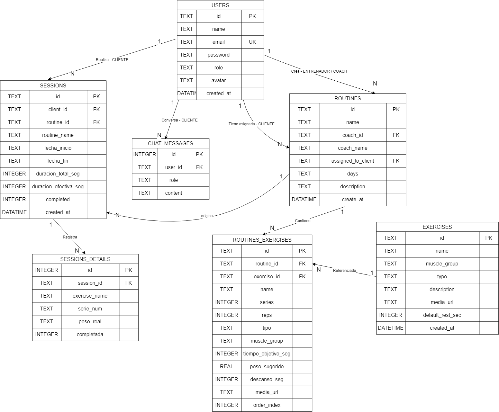

# Requisitos del Sistema — GymPro

## 1. Necesidades identificadas

A partir del análisis de algunas aplicaciones, se identificaron las siguientes necesidades:

1. **Centralización** de rutinas y ejercicios en una sola plataforma.
2. **Asignación personalizada** de rutinas según objetivos del cliente.
3. **Seguimiento objetivo** de progreso (pesos, series, duración).
4. **Guía paso a paso** durante el entrenamiento (para evitar dudas).
5. **Comunicación asíncrona** entre coach y cliente.
6. **Control de acceso** por roles (administrador, Entrenador, Cliente).
7. **Historial consultable** para evaluar evolución.
8. **Asistencia 24/7** para dudas de técnica y motivación.

---

## 2. Requisitos funcionales

### RF-01: Autenticación
- Registro de nuevos usuarios.
- Login con email y contraseña.
- Contraseñas hasheadas con bcrypt.
- Roles: admin, coach, cliente.

### RF-02: Gestión de usuarios (Admin)
- Crear, listar, editar y eliminar usuarios.
- Cambio de rol.
- Búsqueda por email.

### RF-03: Catálogo de ejercicios
- Crear ejercicios con nombre, grupo muscular, tipo (reps/tiempo).
- Descripción, imagen y descanso por defecto.
- Visualización en grid.

### RF-04: Rutinas
- Coach crea rutinas con múltiples ejercicios.
- Cada ejercicio tiene: series, reps/tiempo, peso, descanso.
- Asignación a cliente específico o como plantilla.
- Selección de días de la semana.
- Edición y eliminación.

### RF-05: Modo entrenamiento
- Vista previa de la rutina antes de empezar.
- Cronómetro general de la sesión.
- Cronómetro por ejercicio (ascendente para reps, descendente para tiempo).
- Temporizador de descanso entre series.
- Registro de peso real usado.
- Pausa / reanudar / saltar ejercicio / serie extra.
- Persistencia ante recarga del navegador.

### RF-06: Progreso del cliente
- Historial de sesiones completadas.
- Duración total vs efectiva por sesión.
- Peso máximo por ejercicio.
- Filtros por fecha.

### RF-07: Análisis del coach
- Panel de alumnos con su rutina actual.
- Modal de progreso por alumno.
- Resumen semanal con tendencias (↑↓).
- Detalle serie por serie.

### RF-08: Chat con IA
- Asistente personal contextualizado.
- Conoce rutina, historial y pesos del cliente.
- Consciencia temporal (fecha actual).
- Historial persistente por usuario.

### RF-09: Log de actividades
- Registro de todas las acciones en archivo plano.
- Formato: `FECHA | USUARIO | ACTIVIDAD | DETALLE`.
- Actividades: LOGIN, LOGOUT, CONSULTA, REGISTRO, ELIMINACION.

### RF-10: Foto de perfil
- Subir imagen (JPG, PNG, WEBP).
- Redimensionado automático.
- Almacenado como Base64.

---

## 3. Requisitos no funcionales

| Código | Categoría | Descripción |
|--------|-----------|-------------|
| RNF-01 | Usabilidad | Interfaz responsive (móvil, tablet, desktop) |
| RNF-02 | Rendimiento | Respuesta < 500ms en operaciones CRUD |
| RNF-03 | Seguridad | Contraseñas con bcrypt (factor 10) |
| RNF-04 | Seguridad | API key de IA solo en backend |
| RNF-05 | Seguridad | Validación de entradas en backend |
| RNF-06 | Mantenibilidad | Código modular (routes/services/models) |
| RNF-07 | Escalabilidad | Posibilidad de migrar de SQLite a PostgreSQL |
| RNF-08 | Disponibilidad | Funciona sin conexión a IA (fallback) |
| RNF-09 | Compatibilidad | Navegadores modernos (Chrome, Firefox, Safari) |
| RNF-10 | Documentación | README + docs/ con toda la información |

---

## 4. Actores y funciones principales

### 👑 Administrador
- Gestiona usuarios, ejercicios y rutinas globales.
- Ve métricas del sistema.
- Accede al log de actividades.
- **No puede** crear rutinas específicas (eso es del coach).

### 💪 Entrenador (Coach)
- Crea rutinas para sus alumnos.
- Asigna rutinas a clientes.
- Consulta progreso de alumnos.
- **No puede** gestionar usuarios globales.

### 🏃 Cliente
- Ejecuta rutinas asignadas.
- Registra su progreso.
- Consulta su historial.
- Chatea con la IA.
- **No puede** crear rutinas ni ver otros clientes.

---

## 5. Requisitos de datos

### Entidades principales
- `users` (id, name, email, password, role, avatar)
- `exercises` (id, name, muscle_group, type, description, media_url, default_rest_sec)
- `routines` (id, name, coach_id, coach_name, assigned_to_client_id, days, description)
- `routine_exercises` (routine_id, exercise_id, series, reps, peso_sugerido, descanso_seg, orden)
- `sessions` (id, client_id, routine_id, fecha_inicio, fecha_fin, duracion_total_seg, duracion_efectiva_seg)
- `session_details` (session_id, exercise_id, serie_num, peso_real, tiempo_seg, completada)
- `chat_messages` (id, user_id, role, content, created_at)

### Relaciones
- Un `coach` crea muchas `routines` (1:N)
- Un `client` tiene muchas `sessions` (1:N)
- Una `routine` tiene muchos `routine_exercises` (1:N)
- Una `session` tiene muchos `session_details` (1:N)
- Un `user` tiene muchos `chat_messages` (1:N)

